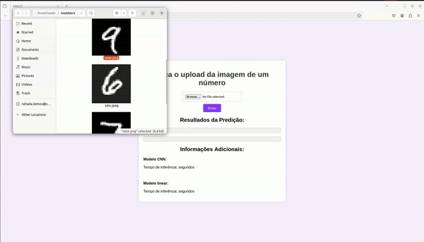

# Aplicação prática de Redes Convolucionais
Utilizar redes neurais convolucionais para tarefas de visão computacional.



É possível anexar a foto de um número, e os modelos convolucional e linear irão identificar qual número está na imagem. Além disso, tem-se também o tempo de inferência que cada modelo levou para identificar a imagem de input.

Para ver a demonstração completa, [clique aqui](https://drive.google.com/file/d/1BNCYyMlQ8iXJFrxA4G6YCcKuIYOgiWiS/view?usp=sharing)

---
### Modelos

Foi feita uma comparação dos modelos, considerando que ambos foram treinados com 100 épocas.

##### Modelo linear
|    Tempo de treinamento   |    Acurácia    |
| ------------------------- | -------------- |
| 227.295852184295 segundos | 0.984300017    |

##### Modelo convolucional
|    Tempo de treinamento   |    Acurácia    |
| ------------------------- | -------------- |
| 444.202180147171 segundos | 0.994499981    |


---
### Execução

1. Clone este repositório
```bash
git clone https://github.com/rafaelarojas/mnist.git
```

2. Instale todas as dependências
```bash
pip install -r requirements.txt
```

3. E certifique que algumas bibliotecas importantes estão instaladas
```bash
pip install flask tensorflow numpy os
```

4. Para executar, certifique-se que está dentro da pasta `mnist/src` e rode
```bash
python3 app.py
```
